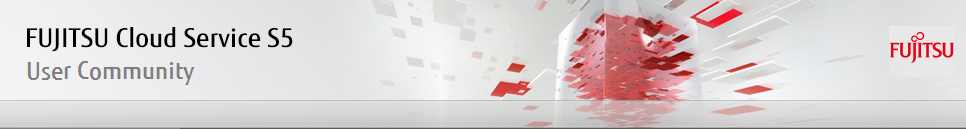

# Let's exchange information useful.

Here is a public cloud service that Fujitsu provides a global "FUJITSU Cloud Service S5"
It is available to community site for the user.
Information and to help in the construction of service of use and system, the forum will be available for the exchange of information.
Forum, becoming operational with Issues.

## Please be careful.

Here is a community site for the user to use the "FUJITSU Cloud Service S5".
For what is the question in this site, there is no one that can be committed to answer.

Or slander others, and therefore you should not post content contrary to the public.
If the public contrary to what has occurred, delete the article by an administrator, you might want to close the Issues.

Such as authentication information, and information related to security, personal information, etc. and therefore you should not be written.

So that you can refer to other users, and therefore you should not be closed even if they are problem-solving in the content of our post.

